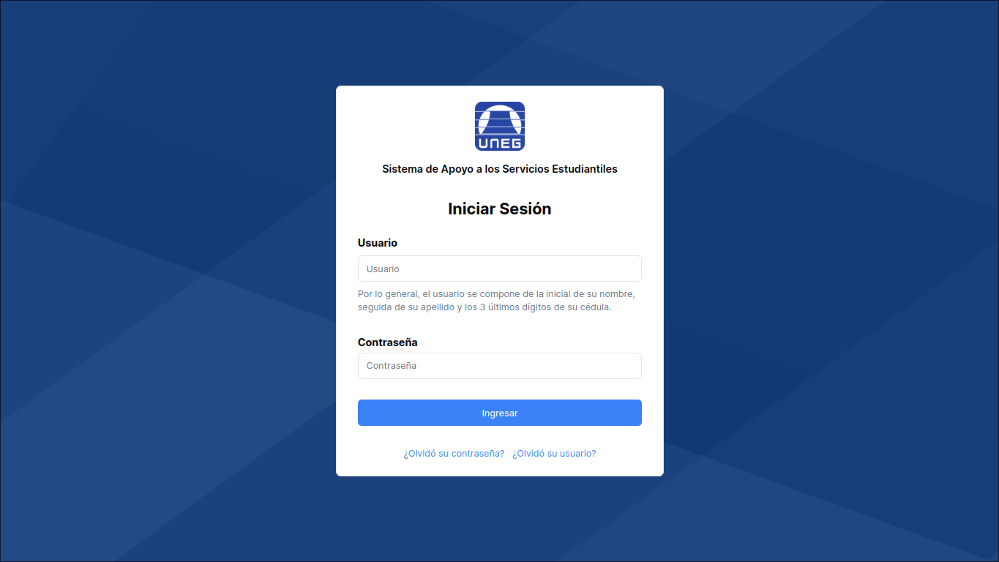

<div align="center">

[![Contributors][contributors-shield]][contributors-url]
[![Forks][forks-shield]][forks-url]
[![Stargazers][stars-shield]][stars-url]
[![Pull Requests][pr-shield]][pr-url]
[![Issues][issues-shield]][issues-url]

</div>



---

# Página de servicios estudiantiles

Este repositorio constituye el segmento de interfaz de usuario de nuestro proyecto,
cuyo objetivo es sustituir el sitio web de servicios estudiantiles de la
Universidad Nacional Experimental de Guayana, el cual no satisface los requerimientos de los alumnos.

## Tecnologías

- HTML, CSS y JavaScript
- TypeScript
- React
- Next.js
- Node.js
- Tailwindcss

## Ejecución

Clona el proyecto

```bash
  git clone https://github.com/Gabo-div/uneg-sase-frontend
```

Accede a la ruta del proyecto

```bash
  cd uneg-sase-frontent
```

Instala las dependencias

```bash
  npm install
```

Inicia el servidor de desarrollo

```bash
  npm run dev
```

## Contribuciones

Las contribuciones siempre son bienvenidas. Consulta el archivo [`CONTRIBUTING.md`](CONTRIBUTING.md)
para obtener información sobre cómo comenzar.

**¡Gracias a todos los colaboradores!**

[](contributors-url)

[contributors-shield]: https://img.shields.io/github/contributors/Gabo-div/uneg-sase-frontend.svg?style=for-the-badge
[contributors-url]: https://github.com/Gabo-div/uneg-sase-frontend/graphs/contributors
[forks-shield]: https://img.shields.io/github/forks/Gabo-div/uneg-sase-frontend.svg?style=for-the-badge
[forks-url]: https://github.com/Gabo-div/uneg-sase-frontend/network/members
[stars-shield]: https://img.shields.io/github/stars/Gabo-div/uneg-sase-frontend.svg?style=for-the-badge
[stars-url]: https://github.com/Gabo-div/uneg-sase-frontend/stargazers
[pr-shield]: https://img.shields.io/github/issues-pr-closed/Gabo-div/uneg-sase-frontend.svg?style=for-the-badge
[pr-url]: https://github.com/Gabo-div/uneg-sase-frontend/pulls
[issues-shield]: https://img.shields.io/github/issues/Gabo-div/uneg-sase-frontend.svg?style=for-the-badge
[issues-url]: https://github.com/Gabo-div/uneg-sase-frontend/issues
